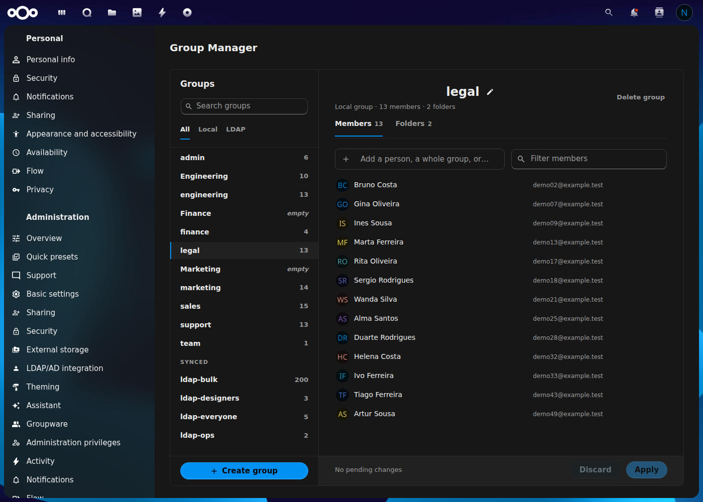
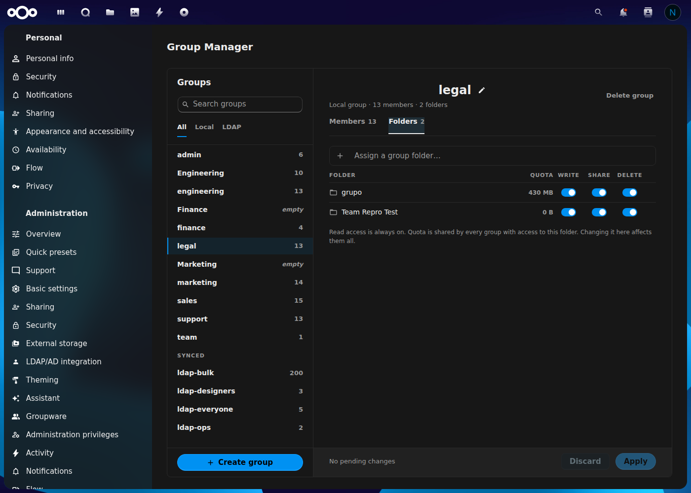
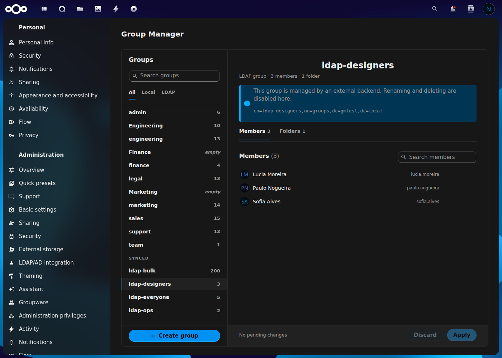

<!--
  - SPDX-FileCopyrightText: 2026 Ricardo Ferreira <rsfneg@gmail.com>
  - SPDX-License-Identifier: AGPL-3.0-or-later
  -->

# Group Manager for Nextcloud

**Browse every group, local or LDAP, and manage membership and group-folder
access from one screen — no more one-user-at-a-time from the Users page.**

Group Manager gives administrators a single admin-settings screen to browse
all groups on the instance (local and LDAP/AD), inspect and bulk-edit local
group membership, and — when the Team Folders app is installed — create or
assign group folders and their per-group permissions and quota, without
leaving Settings.



## Problem Solved

Nextcloud's own Users page manages group membership from the *user's* side:
open a person, tick the groups they belong to, one person at a time. There is
no screen for the opposite, much more common admin task — *"open this group,
see everyone in it, add or remove several people at once, and see which
shared folders it can reach"* — short of `occ group:adduser`/`removeuser` one
call per person, or juggling the Team Folders admin page separately. Group
Manager is that screen.

## Features

- **Browse all groups** — local and LDAP/AD side by side, searchable, with
  an All / Local / LDAP filter. LDAP groups sit under their own **Synced**
  heading. Two groups whose display name only differs by case (a common LDAP
  artifact) show their real ID so they stay distinguishable.
- **Bulk membership editing** — one field adds a person, an entire group (all
  of its members not already in this one, as a single queued action), or a
  pasted multi-line list of usernames/emails, resolved and reviewed before
  it's queued. Click the field to browse addable people alphabetically, or
  type to filter; tick several in one search without reopening it. Nothing is
  applied until you hit **Apply** — a colored chip queue shows exactly what's
  about to change, and a limited-concurrency batch applies it without
  aborting the whole batch over one bad row (a deleted account, say) — that
  one row surfaces its error and **Try again** retries only what failed.
- **Group-folder creation & assignment** (needs the **Team Folders** app) — a
  second tab lists the group folders this group can reach, with per-group
  **Write / Share / Delete** switches (read is always implied), the folder's
  quota (editable — it belongs to the folder and is shared by every group
  with access, and the UI says so), and a badge when a folder has advanced
  permissions (ACL) turned on, since effective access can then be narrower
  than the switches show. A **Create group folder** button provisions a
  brand-new folder and assigns it to the current group in one step —
  Nextcloud asks you to confirm your password first, since this creates real
  storage. This works for LDAP groups too — group-folder assignment isn't
  tied to how the group's *members* are managed, only membership is.
- **LDAP groups are read-only where they have to be** — you can't add or
  remove an LDAP group's members here (that's the directory's job), and the
  panel says so with the group's DN. Everything else — browsing, and folder
  assignment — works the same as for a local group.
- **Keyboard-friendly** — arrow keys and Enter drive the add-field dropdown,
  Esc closes it, and switching to a different group while changes are still
  queued asks for confirmation first.

## Installation

Group Manager is not yet on the App Store — install it from source:

```bash
cd /path/to/nextcloud/apps
git clone https://github.com/kreotropic/group_manager.git
php occ app:enable group_manager
```

> **Note:** compiled JavaScript is included in the repository, so `npm install`/`npm run build` are only needed if you modify the frontend source.

## Usage

Open **Settings → Administration → Group Manager**. Pick a group on the left;
its **Members** and (if Team Folders is installed) **Folders** tabs appear on
the right, each with its own add field and a shared **Discard**/**Apply**
footer at the bottom of the panel.

Creating and deleting *groups themselves* (as opposed to editing an existing
one's membership) is also done from this screen — **Create group** at the
bottom of the list, **Delete group** in a group's own header.

## Known Limitations

- **The Folders tab only exists when the Team Folders app (`groupfolders`) is
  installed and enabled.** No tab, no placeholder — the feature simply isn't
  offered, since there is nothing to assign.
- **LDAP group *membership* cannot be edited here, by design.** LDAP/AD is
  the source of truth for who belongs to a synced group; this app only lets
  you browse it. Folder access for that same group is a separate, local
  concept and stays editable.
- **Quota is a folder property, not a per-group one.** Changing it from a
  group's Folders tab changes it for every other group that also has access
  to that folder — the UI says this explicitly next to the field.

## Translations

The app interface is available in:

- **English** (default)
- **Portuguese (Portugal)** / Português (Portugal)
- **German** / Deutsch
- **Spanish** / Español
- **French** / Français

Contributions for additional languages are welcome — add a `l10n/<locale>.json`
and regenerate the matching `l10n/<locale>.js` with `python3 build/l10n.py`.

## Requirements

- Nextcloud 31–34
- PHP 8.1 or later
- Optional: the **Team Folders** (`groupfolders`) app, for the Folders tab
- Optional: **`user_ldap`**, for LDAP/AD group browsing

## License

[AGPL-3.0-or-later](LICENSE) © Ricardo Ferreira.

## Development

The frontend is Vue 3 + `@nextcloud/vue`; the backend wraps
`IGroupManager`/`IGroup`/`IUserManager` and, for the Folders tab, the Team
Folders app's own `FolderManager` (resolved lazily, so this app has no hard
dependency on it — the tab just doesn't render if it isn't installed). See
the code under `lib/` and `src/`.

### Frontend build

Compiled JavaScript is committed to the repository, so a build is only needed
when you change the Vue/JS sources under `src/`:

```bash
npm install
npm run build      # production build
npm run watch      # rebuild on change
```

### Translations build

After editing a translation, regenerate the frontend `l10n/*.js` bundles from
the `l10n/*.json` sources (and check for missing/orphaned strings):

```bash
python3 build/l10n.py           # regenerate all l10n/<lang>.js
python3 build/l10n.py --check   # CI: fail if strings are missing
```

## Contributing

Pull requests welcome! Please open an issue first to discuss significant changes.

## Screenshots

| Members (bulk add/remove, chip queue) | Group folders (permissions, quota, ACL badge) |
|---|---|
|  |  |



*The snapshots above show the Members tab mid-edit-free state with the chip
queue ready to receive changes, the Folders tab with two group folders
assigned and their permissions, and an LDAP group's read-only member list
with its directory DN.*

## Roadmap

Planned work (accessibility contrast pass, App Store publication, and more)
is documented in [ROADMAP.md](ROADMAP.md).

## Changelog

See [CHANGELOG.md](CHANGELOG.md) for the full version history.

## Support

- Issues: [GitHub Issues](https://github.com/kreotropic/group_manager/issues)
- Forum: [Nextcloud Community](https://help.nextcloud.com)

## Author

Ricardo Ferreira
